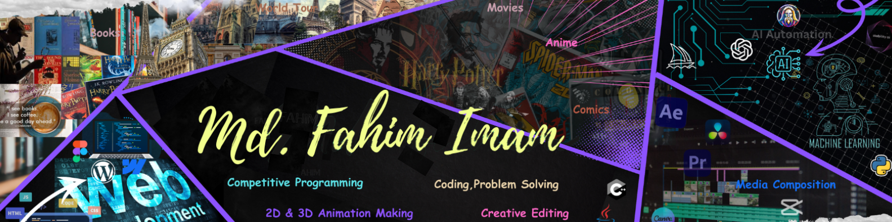

## 
<h1 align="center">Hi 👋, I'm Fahim</h1>
<h3 align="center">A passionate frontend developer , ML & AI enthusiast </h3>

  

- 🔭 I’m currently working on **Front-End web dev**

- 🌱 I’m currently learning **Machine Learning and AI**

- 👯 I’m looking to collaborate on <strong>I don't know yet</strong> 

- 👨‍💻 All of my projects are available at [website](scns)

###
# 💻 Tech Stack:

  
  

  
  

  
  
  
  
  
 
  
  
  
  
  
  
  
 
  
  
  
  
  
 
  
  
  
 
  
  
  
  
  
  
  
  
  
  
  
  
  
 
  
  
  
  
 

  
  
  
  
  
  
  
  

# 💻 Other Skills:
               

## 🌐 Socials:

  

# 📊 GitHub Stats:

  
  

## 🏆 GitHub Trophies

### ✍️ Random Dev Quote

### 🔝 Top Contributed Repo

---

<!-- Proudly created with GPRM ( https://gprm.itsvg.in ) -->

<!-- This ends here-->

###

<!--  -->

<!-- ends here -->

<h3 align="left">Support:</h3>

  

